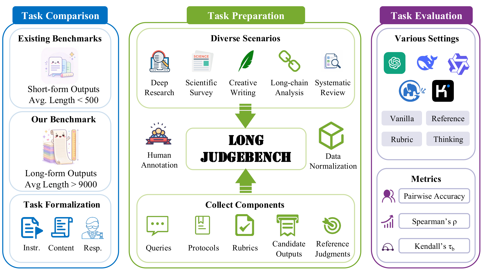
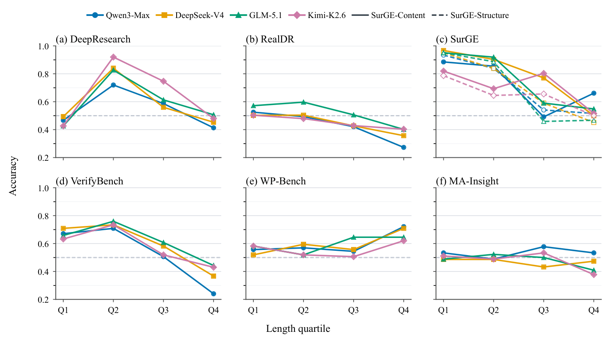

<div align="right">
  <b>中文</b> | <a href="README.md">English</a>
</div>

<br>

<div align="center">
  <h1>LongJudgeBench</h1>
  <p>
    <b>面向长文本生成的 LLM-as-Judge 评测框架</b>
  </p>
  <p>
    
    
    
    
  </p>
</div>

---

LongJudgeBench 是一个面向长文本生成的 LLM-as-Judge 评测框架，支持 **pointwise**（逐点评分）、**pairwise**（成对比较）、**listwise**（排序比较）三种评测范式，覆盖研究报告、文档质量、写作偏好、综述生成等多种长文本场景（1K–68K 字符）。

<p align="center">
  
  <br>
  <em>图 1：LongJudgeBench 总览 — 任务形式化、数据构建流程与评测框架。</em>
</p>

## 目录

- [核心特性](#核心特性)
- [数据集统计](#数据集统计)
- [主要发现](#主要发现)
- [快速开始](#快速开始)
- [评测范式](#评测范式)
- [Prompt 模式](#prompt-模式)
- [数据格式](#数据格式)
- [项目结构](#项目结构)
- [输出格式](#输出格式)
- [引用](#引用)

## 核心特性

- **6 个多样化数据集**覆盖 pointwise / pairwise / listwise 三种评测协议
- **双语支持**（中文、英文任务）
- **4 种 prompt 变体**：vanilla / rubric / reference / rubric+reference
- **8 个 judge 模型**：GPT-5.2, GPT-4o-mini, DeepSeek-V4-Flash, Qwen3-Max, Qwen3-32B, Qwen3-32B (no-thinking), Kimi-K2.6, GLM-5.1
- **3 种一致性指标**：pairwise ACC, Spearman, Kendall's τ
- **长度敏感性分析**：按输出长度分桶计算准确率
- **失败案例分析**：系统性识别 judge 评测错误类型及根因
- **断点续跑**：重复执行自动跳过已完成项

## 数据集统计

| 数据集             | 范式      | 语言  | 记录数              | 平均 Token | 任务                           |
| ------------------ | --------- | ----- | ------------------- | ---------- | ------------------------------ |
| deepresearch_bench | pointwise | zh    | 200 (50 × 4 模型)  | 10,312     | 深度研究报告评分（4 维度加权） |
| realdr             | pointwise | en/zh | 640 (40 × 16 模型) | 8,876      | 文档质量评分（3 维度加权）     |
| verify_bench_hard  | pointwise | en    | 316                 | 3,308      | 二分类验证（Yes/No）           |
| wp_bench           | pairwise  | en/zh | 263 对 (526 回复)   | 1,896      | 写作偏好比较                   |
| ma                 | pairwise  | en    | 120 对              | 4,764      | 医学元分析（insights 维度）    |
| surge              | listwise  | en    | 41 主题 × 4 模型   | 2,521      | 计算机科学综述生成排序         |

### 长度敏感性分析

<p align="center">
  
  <br>
  <em>图 2：不同 Judge 模型在各输出长度区间上的准确率趋势 — 长文本普遍更难可靠评估，最长四分位区间准确率显著下降。</em>
</p>

## 主要发现

基于 8 个 LLM judge 在 6 个数据集上的系统评测：

- **可靠性因模型和数据集显著差异**：Pairwise 准确率从 ~55%（接近随机）到 ~85% 不等，不存在普遍可靠的 judge 模型。
- **长度是系统性难度因素**：大多数数据集中，最长输出四分位的 judge 准确率持续下降。在 realdr 和 verify_bench_hard 上最为显著，最长区间准确率低于 60%。
- **Rubric 和 Reference 的效果依赖任务**：Reference 模式在 verify_bench_hard 上显著提升准确率（70.9% → 82.3%），但在 wp_bench 上反而下降（75.3% → 65.2%）。
- **三类失败模式**解释了 judge 与人类的主要分歧：
  - *(a) 语义粒度过粗*：Judge 进行关键词匹配而非概念验证。长文本中外围信息淹没核心概念差异（如混淆 "Streamable HTTP" 与 "Messages API SSE streaming"）。
  - *(b) 评测需求错位*：Judge 评估表面主题覆盖，人类评估精确任务完成。长文本可以"切题"但不"完成任务"。
  - *(c–e) 其他模式*：Rubric 机械化（打勾清单思维）、位置偏差（部分模型高达 95%）、分数压缩（仅特定模型出现）。
- **分数压缩非普遍现象**：仅 GPT-4o-mini 存在严重压缩（σ=0.55 vs GT σ=1.22），Reference 模式可将其扩展至 σ=1.00。
- **任务特定盲区**：verify_bench_hard 中 14.9% 的案例全部 8 个 judge 均与真值不一致。语义理解类（D2-Semantic）错误率达 66.7%。

## 快速开始

### 1. 安装依赖

```bash
pip install -r requirements.txt
```

### 2. 配置 API

编辑 `config/api_config.json`，填入 API base 和 key。

### 3. 单任务运行

```bash
bash scripts/run_judge.sh <dataset> <paradigm> <model> [--prompt MODE] [--workers N]
```

示例：

```bash
# pointwise 评测
bash scripts/run_judge.sh deepresearch_bench pointwise gpt-4o-mini --prompt vanilla

# surge/ma 等需带维度前缀
bash scripts/run_judge.sh surge listwise gpt-4o-mini --prompt structure_vanilla
```

### 4. 全量实验

```bash
bash scripts/run_all.sh
bash scripts/run_all.sh --model gpt-4o-mini --prompt vanilla
```

### 5. 并行运行

```bash
bash scripts/run_parallel.sh --model qwen3-32b --model deepseek-v4-flash --workers 4
```

### 6. 计算可靠性指标

```bash
python src/evaluation/compute_reliability.py <dataset> <paradigm> <model> --prompt <mode>
```

### 7. 导出结果为 xlsx

```bash
# 导出所有结果为单一 xlsx 汇总表格
python src/evaluation/export_results_xlsx.py

# 仅导出指定模型
python src/evaluation/export_results_xlsx.py --models gpt-4o-mini qwen3-32b
```

结果保存在 `outputs/reliability_summary.xlsx`（或自定义路径）。

> **提示：** 所有命令均内置断点续跑，重复执行会自动跳过已完成项。

## 评测范式

| 范式                | 说明                                       | 适用数据集                                    |
| ------------------- | ------------------------------------------ | --------------------------------------------- |
| **pointwise** | 对每个 model 的回复独立评分（0-10 或 0/1） | deepresearch_bench, realdr, verify_bench_hard |
| **pairwise**  | 比较两个回复，选偏好 A/B                   | wp_bench, ma                                  |
| **listwise**  | 对多个回复排序（pointwise 打分后转排序）   | surge                                         |

## Prompt 模式

每个数据集支持以下 prompt 模式变体：

| 模式                       | 说明                                  |
| -------------------------- | ------------------------------------- |
| **vanilla**          | 基础评分指令                          |
| **rubric**           | 带评分标准（criteria_list）的维度评分 |
| **reference**        | 提供参考文章辅助评分                  |
| **rubric_reference** | 评分标准 + 参考文章                   |

Pairwise 数据集（ma）和 listwise 数据集（surge）额外按评分维度加前缀：

| 数据集 | 可用 Prompt 模式                                                                                                                                                                                                                                   |
| ------ | -------------------------------------------------------------------------------------------------------------------------------------------------------------------------------------------------------------------------------------------------- |
| surge  | `content_vanilla`, `structure_vanilla`, `content_vanilla_reference`, `structure_vanilla_reference`, `content_vanilla_rubric`, `structure_vanilla_rubric`, `content_vanilla_rubric_reference`, `structure_vanilla_rubric_reference` |
| ma     | `insights_vanilla`, `insights_vanilla_reference`, `insights_vanilla_rubric`, `insights_vanilla_rubric_reference`                                                                                                                           |

## 数据格式

标准化评测数据统一为 JSONL 格式（`data_standardized/{dataset}.jsonl`）：

```json
{
  "dataset": "数据集名",
  "id": "唯一 ID",
  "instruction": "任务指令 / prompt",
  "responses": [
    {"model": "模型名", "content": "模型回复全文"}
  ],
  "ground_truth": { /* 真值，格式见下 */ },
  "meta": {
    "language": "zh / en",
    "task_type": "pointwise / pairwise / listwise",
    "source": "数据来源"
  }
}
```

### 真值格式

| 范式      | ground_truth 格式                                                 | 指标                                 |
| --------- | ----------------------------------------------------------------- | ------------------------------------ |
| pointwise | `{"type": "pointwise_...", "scores": {model: score}}`           | pairwise ACC, Spearman, Kendall's τ |
| pairwise  | `{"type": "pairwise_preference", "preferred": "A/B/tie"}`       | ACC                                  |
| listwise  | `{"type": "listwise_ranking", "dimension_name": {model: rank}}` | Spearman, Kendall's τ, pairwise ACC |

参考文件（`{dataset}_reference.jsonl`）包含 reference 模式所需的参考文本。

## 项目结构

```
├── config/                    # 评测配置 & prompt 模板
│   ├── judge_config.yaml      # 评测参数（temperature, max_tokens）
│   ├── prompts/{dataset}/     # prompt 模板（vanilla/rubric/reference 变体）
│   └── dataset_registry.json  # 数据集注册信息
├── data/                      # 原始数据集
├── data_standardized/         # 标准化后的 JSONL 数据
├── ground_truth/              # 真值文件
├── src/
│   ├── evaluation/            # 评测主流程
│   │   ├── run_judge.py       # Judge 运行入口
│   │   ├── compute_reliability.py  # 可靠性指标计算
│   │   └── datasets/          # 数据集适配模块
│   ├── judge/                 # Judge 实现
│   │   ├── base_judge.py      # 基类（JSON 解析、错误处理）
│   │   ├── pointwise_judge.py
│   │   ├── pairwise_judge.py
│   │   ├── listwise_judge.py
│   │   └── api_clients/       # API 客户端
│   ├── reliability/           # 指标计算
│   │   └── agreement_metrics.py
│   ├── standardization/       # 数据标准化脚本
│   ├── length_analysis/       # 长度敏感性分析
│   ├── case_study/            # 失败模式案例研究
│   └── utils/                 # 工具类
├── scripts/                   # 运行脚本（bash 入口）
├── outputs/                   # 评测输出（运行时生成）
│   ├── judge_results/         # Judge 原始输出（JSONL）
│   ├── reliability_scores/    # 可靠性结果（JSON）
│   └── length_sensitivity/    # 长度敏感性分析（JSON）
├── images/                    # 图片和示意图
├── requirements.txt
└── LICENSE
```

## 输出格式

### Judge 输出

保存在 `outputs/judge_results/{model}/{dataset}/{mode}.jsonl`，每行一条：

```json
{
  "data_id": "记录 ID",
  "model": "模型名",
  "judge_result": { "overall_score": 8.5, ... },
  "response": "Judge 原始回复内容"
}
```

错误记录输出到 `{mode}_errors.jsonl`、`{mode}_token_exceed.jsonl` 等。

## 引用

```bibtex
@article{longjudgebench,
  title={LongJudgeBench: A Benchmark for Evaluating LLM-as-a-Judge on Long-Form Outputs},
  author={},
  journal={},
  year={2026}
}
```

## 许可证

本项目基于 [MIT 许可证](LICENSE) 开源。
